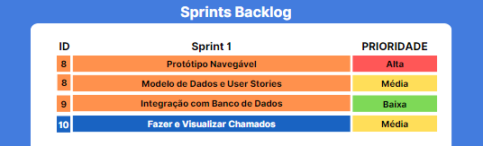

# Sprint - 1️⃣ 🎯
Nesta Sprint foram criados e apresentados o Backlog do Projeto, o wireframe do Projeto e a funcionalidade da criação de chamados. 
 
 
[Clique aqui para ver como foi a apresentação da Sprint](https://prezi.com/view/SdWGFlyJoB4iychRUiW9/)
 
 
## Backlog da Sprint🌱

 

## User Story's 📝
  
| ID US | Sprint | US                                                                                                                                                                                                                               | ID Requisito          | US Points  |
|:-------:|:--------:|:----------------------------------------------------------------------------------------------------------------------------------------------------------------------------------------------------------------------------------:|:-----------------------:|:--------:|
| US01  | 1     | "Eu, como um usuário, gostaria de criar um chamado"                                                                                                                                                                                          |  #10               |  60    |
| US02  | 1      | "Eu, como um usuário, gostaria de poder cadastrar um equipamento ao criar um chamado, para auxiliar na resolução do problema. "                                                                                                             |  #10               |  50    |
| US03  | 1      | "Eu, como um usuário, quero acessar o chamado que criei, para poder ver os detalhes dele."                                                                                                                                                  |  #10               |  30    |
| US04  | 1      | "Eu, como desenvolvedor , quero elaborar um wireframe e apartir deste um protótipo navegável, para criar uma perspectiva sobre como será a interface do sistema e auxiliar no desenvolvimento futuro. "                                     |  #08               |  80    |
| US05  | 1      | "Eu, como desenvolvedor, quero elaborar artefatos como: Sprint Backlog, Backlog total, MVP, Modelo de dados e User Stories, para auxiliar no desenvolvimento do projeto e ilustarar o que será entregue em cada sprint. "                   |  #08               |  80    |
| US06  | 1      | "Eu, como desenvolvedor, quero criar um banco de dados relacional usando MySQL, seguindo o modelo de dados que foi elaborado, para assim salvar e exibir os chamados e seus atributos, criados pelo usuário que utilizar o sistema. "       |  #09               |  30    |

## Protótipo Navegável 🚢
[Clique aqui para visualizar o protótipo](https://www.figma.com/proto/ksqvS3flyANq2J6oVo7kN1/API-2SEM-2023?type=design&node-id=17-24&t=LxQM2fE4YtED8gu2-0&scaling=contain&page-id=0%3A1&starting-point-node-id=17%3A24)

## Criação de Chamados 🗣 
Com essa funcionalidade o usuario que têm acesso ao chamado consegue criar chamados e vizualiza-los. Entretanto o sistema não está no ar ainda, logo o sistema precisa rodar localmente e só é acessado por aqueles com acesso ao código... Nessa visão, já que implantamos o "CallGenie" para uma loja fictícia de informática, somente os funcionários e adm teriam acesso ao mesmo, sendo que existe apenas um usuário único. Ou seja, o cliente ainda precisa ir até a loja e conversar para relatar seu problema, contudo já é possível que um funcionário cadastre os problemas e assim ocorra uma melhor gestão de solução destes mesmos problemas, mesmo que locamente!

